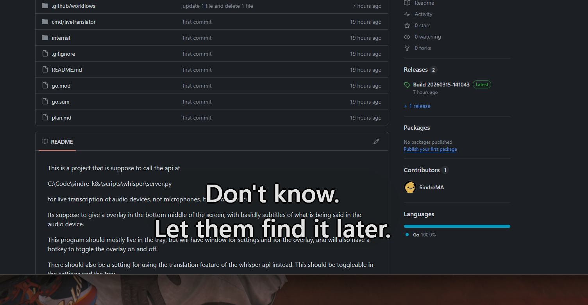
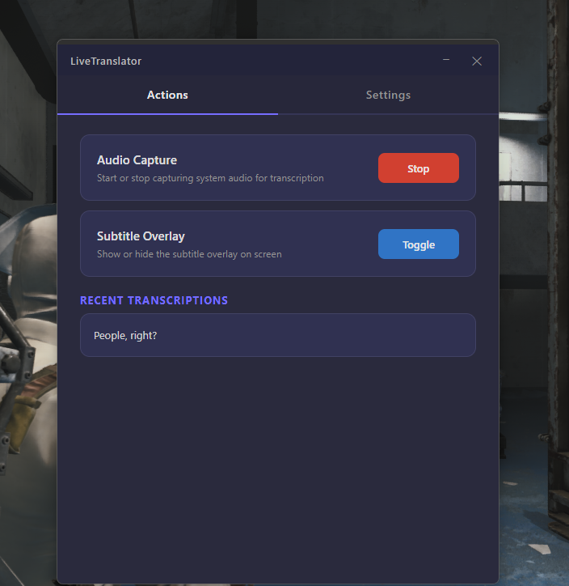
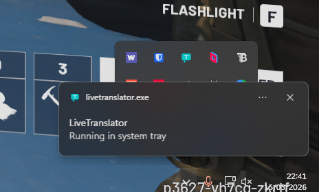
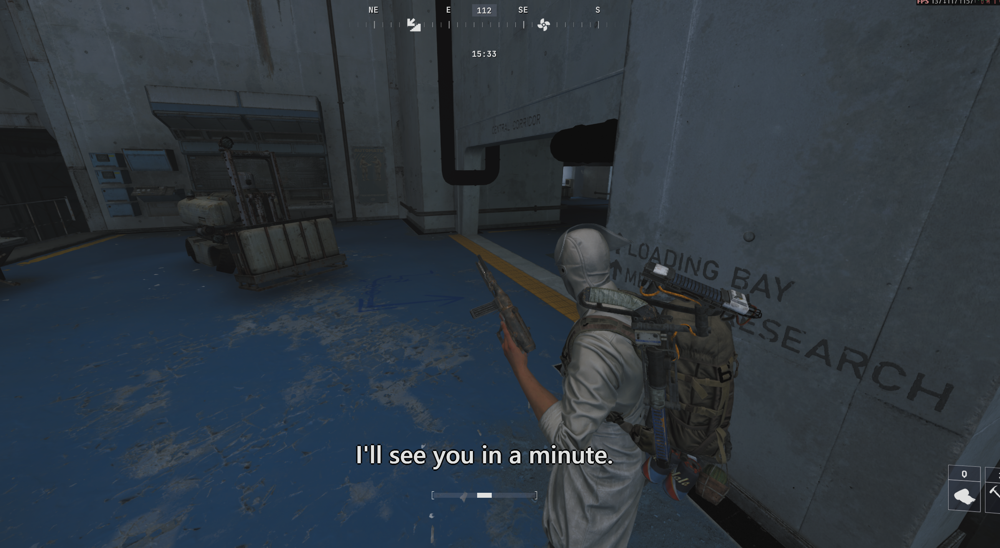

This is a project that is suppose to call the api at

C:\Code\sindre-k8s\scripts\whisper\server.py

for live transcription of audio devices, not microphones, but audio devices.

Its suppose to give a overlay in the bottom middle of the screen, with basiclly subtitles of what is being said in the audio device.

This program should mostly live in the tray, but will have window for settings and for the overlay, and will also have a hotkey to toggle the overlay on and off.

There should also be a setting for using the translation feature of the whisper api instead. This should be toggleable in the settings and the tray.

We should write it in golang, as its system level and we want it to be as efficient as possible, and also to be able to easily create a tray application and overlay window.

